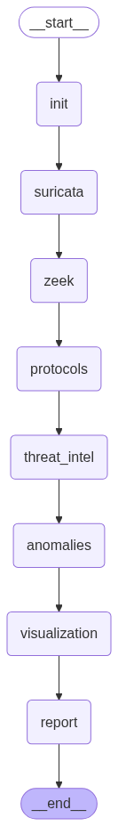

# CynsesAI PCAP Analyzer

## Overview

CynsesAI PCAP Analyzer is a comprehensive network security analysis tool designed to process PCAP files, identify potential threats, and provide detailed insights into network traffic. It leverages powerful open-source tools like Suricata and Zeek, enriches findings with threat intelligence, detects anomalies, classifies network traffic, and generates interactive visualizations and comprehensive reports.

## Features

*   **PCAP Analysis:** In-depth packet analysis using Suricata for intrusion detection and Zeek for network traffic logging.
*   **Threat Intelligence Enrichment:** Correlates network events with threat intelligence feeds (e.g., AbuseIPDB, VirusTotal) to identify known malicious actors.
*   **Anomaly Detection:** Identifies unusual patterns and suspicious activities in network traffic.
*   **Network Traffic Classification:** Utilizes a machine learning model to classify network traffic types.
*   **Interactive Attack Visualization:** Generates dynamic and static graphs of network connections and potential attack paths using NetworkX and Plotly.
*   **Workflow Orchestration:** Uses LangGraph to manage the multi-step analysis process.
*   **AI-Powered Analysis:** Leverages Large Language Models (LLMs) for enhanced data interpretation and report generation.
*   **Comprehensive Reporting:** Produces detailed analysis reports in Markdown and HTML formats, including visual summaries and actionable insights.
*   **Mermaid Diagram Generation:** Creates attack flow diagrams using Mermaid for clear visual representation of attack sequences.

## Workflow

The analysis process is orchestrated as a graph of interconnected tasks:

1.  **Initialization:** Cleans up previous run resources and sets up the analysis environment.
2.  **Suricata Analysis:** Runs Suricata on the PCAP file to detect known threats and log alerts.
3.  **Zeek Analysis:** Runs Zeek on the PCAP file to generate detailed logs of network connections and protocols.
4.  **Merge Results:** Consolidates initial findings from Suricata and Zeek.
5.  **Network Traffic Classification (Optional):** Classifies network traffic using a pre-trained model.
6.  **Protocol Analysis:** Analyzes protocol usage and flags suspicious activities.
7.  **Threat Intelligence Enrichment:** Queries threat intelligence services for IPs found in logs.
8.  **Anomaly Detection:** Identifies anomalies based on Suricata alert patterns.
9.  **Visualization:** Generates network graphs and visualizations.
10. **Report Generation:** Compiles all findings into a comprehensive report.



## Key Technologies

*   **Packet Analysis:** Suricata, Zeek, Scapy
*   **Data Handling & Manipulation:** Python, Pandas
*   **Visualization:** NetworkX, Matplotlib, Plotly, Mermaid (via mmdc)
*   **Workflow & AI:** LangGraph, Langchain, OpenAI/Ollama LLMs
*   **Threat Intelligence:** AbuseIPDB, VirusTotal (via direct API calls)
*   **Caching:** DiskCache
*   **Configuration:** Python (settings.py)

## Setup and Installation

1.  **Prerequisites:**
    *   Python 3.9+
    *   Suricata IDS: [Installation Guide](https://suricata.readthedocs.io/en/latest/install.html)
    *   Zeek Network Security Monitor: [Installation Guide](https://docs.zeek.org/en/master/install.html)
    *   Mermaid CLI (mmdc): `npm install -g @mermaid-js/mermaid-cli` (requires Node.js and npm)
    *   Ensure `suricata` and `zeek` commands are in your system's PATH.

2.  **Clone the Repository:**
    ```bash
    git clone <repository_url>
    cd CynsesAI-PCAP-Analyzer
    ```

3.  **Install Dependencies:**
    ```bash
    pip install -r requirements.txt
    ```

4.  **Configuration:**
    *   Copy or rename `config/settings.py.example` to `config/settings.py` (if an example file is provided - otherwise, directly edit `config/settings.py`).
    *   Update `config/settings.py` with your API keys for:
        *   `CHUTES_API_KEY` (if using Chutes AI for LLM)
        *   `ABUSEIPDB_API_KEY`
        *   `VIRUSTOTAL_API_KEY` (Note: VirusTotal integration is mentioned but might need explicit implementation in `threat_intel.py` if not fully present)
    *   Verify and update paths if necessary:
        *   `PCAP_FILE`: Path to your input PCAP file (e.g., `GoldenEye.pcap`).
        *   `SURICATA_CONFIG`: Path to your `suricata.yaml` configuration file.
        *   `SURICATA_RULES_DIR`: Path to Suricata rules directory.
        *   `SURICATA_OUTPUT_DIR`: Directory for Suricata outputs.
        *   `ZEEK_OUTPUT_DIR`: Directory for Zeek outputs.
        *   `GRAPH_OUTPUT_DIR`: Directory for generated graph images.

## Usage

1.  **Place your PCAP file:** Ensure the PCAP file you want to analyze is correctly pointed to by `PCAP_FILE` in `config/settings.py` or place it in the root directory (e.g., `sample.pcap`, `GoldenEye.pcap`).

2.  **Run the Analysis:**
    ```bash
    python main.py
    ```
    The script will prompt you if you want to run the network traffic classifier.

3.  **Outputs:**
    *   **`pcap_analysis_report.md`:** The main Markdown report containing the analysis summary.
    *   **`attack_graphs/` directory:** Contains generated visualizations:
        *   `enterprise_attack_graph.png`: Static attack graph.
        *   `interactive_attack_graph.html`: Interactive Plotly graph.
        *   `security_summary.html`: HTML summary with charts.
    *   **`attack_flow.png`:** Mermaid diagram showing attack flow.
    *   **`suricata_output/` and `zeek_output/`:** Raw logs from Suricata and Zeek.

## Modules

*   **`main.py`:** The main script that orchestrates the analysis workflow using LangGraph.
*   **`config/settings.py`:** Configuration file for API keys, paths, and other settings.
*   **`modules/`:** Contains the core logic for each analysis step:
    *   **`suricata_parser.py`:** Runs Suricata and parses its output.
    *   **`zeek.py`:** Runs Zeek and processes its logs.
    *   **`network_traffic_classifier.py`:** Classifies network traffic.
    *   **`protocol_analysis.py`:** Analyzes network protocols from Zeek logs.
    *   **`threat_intel.py`:** Enriches data with threat intelligence.
    *   **`anomaly_detection.py`:** Detects anomalies in Suricata alerts.
    *   **`visualization.py`:** Generates various network graphs and visualizations.
    *   **`report_generation.py`:** Compiles the final analysis report.
*   **`Rules/`:** Contains Suricata rule files.
*   **`cache_dir/`:** Caches results from LLM calls and threat intelligence lookups to speed up subsequent runs.

## Customization

*   **Suricata Rules:** Add or modify Suricata rules in the `Rules/` directory and update `suricata.yaml` accordingly.
*   **Analysis Steps:** Modify the LangGraph workflow in `main.py` to add, remove, or change analysis nodes.
*   **LLM Prompts:** Adjust the prompts used for LLM interactions within the respective modules for more tailored analysis.
*   **Visualization Parameters:** Tweak parameters in `modules/visualization.py` to change the appearance and layout of graphs.

## Contributing

Contributions are welcome! Please feel free to fork the repository, make your changes, and submit a pull request. For major changes, please open an issue first to discuss what you would like to change.

1.  Fork the Project
2.  Create your Feature Branch (`git checkout -b feature/AmazingFeature`)
3.  Commit your Changes (`git commit -m 'Add some AmazingFeature'`)
4.  Push to the Branch (`git push origin feature/AmazingFeature`)
5.  Open a Pull Request

## License

Distributed under the MIT License. See `LICENSE` file for more information.
